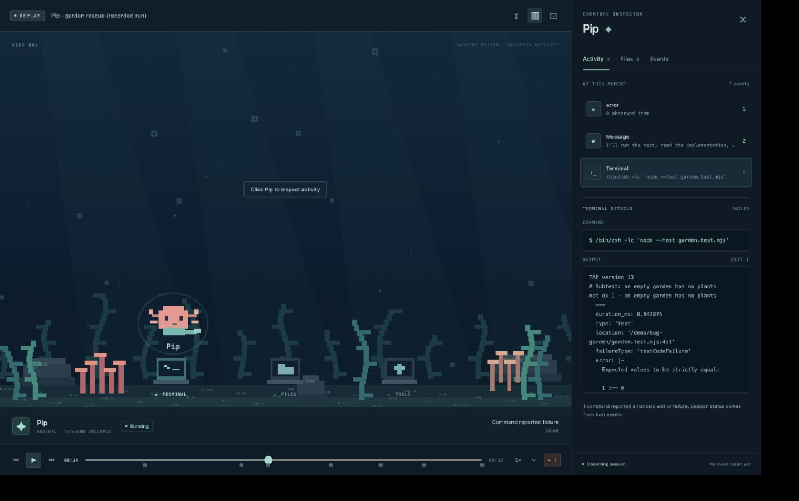

# Reef

A pixel-art aquarium for real Codex activity. Watch a named sea creature visit underwater activity stations, inspect what actually happened, and rewind a recording to the moment a test failed.



Reef runs locally. The aquarium is decorative; commands, file reports, errors, and completion come from observed Codex events.

## Start

Requirements: Node.js 22+, npm, and a local Codex login for live runs. Replay and the built-in demo need no credentials.

```sh
git clone https://github.com/Dharshan2004/reef.git
cd reef
npm ci
npm run dev
```

Open **http://127.0.0.1:5173**. Load the DEMO to explore without running an agent, or choose **Replay recorded run** for the real recorded garden rescue. To launch a real task, sign in with `codex login`, choose a local project directory, name your creature, and enter a task. Reef requests `gpt-6.1-sol`; availability depends on your Codex account. It does not silently substitute another model.

For a production build:

```sh
npm run build
npm start
```

Then open **http://127.0.0.1:4318**.

## A test fails. A creature investigates. Rewind the evidence.

```sh
npm run demo:reset
```

Choose the `demo/bug-garden` directory and ask Codex:

> Run `node --test garden.test.mjs` first to observe the failure. Read the implementation, fix only `garden.mjs`, then rerun the test. Explain the fix briefly.

Click the creature to inspect activity. After completion, switch to replay and seek backward to the first failed command. The task can complete successfully while its earlier failure remains visible.

See [the three-minute demo script](docs/demo-script.md) and [verification results](docs/verification.md).

## Recording and sharing

Reef automatically saves raw sessions under `.reef-data/` (ignored by Git). Pause, step, scrub, or replay a session through the same state reducer used by live mode. Import `.reef` files without executing their commands.

Use **Export** to select fields and inspect the JSON before downloading. Prompt, commands, paths, and content are independently selectable. Text and tool output may themselves contain sensitive information, so review the preview. Do not commit private recordings.

## ChatGPT plugin

The plugin adds a `.reef` custom file viewer and a conversation aquarium panel using the current ChatGPT plugin extensions APIs. It uses the same event reducer and procedural aquarium. See [plugin installation and verified status](docs/plugin.md).

```sh
npm run plugin:build
npm run plugin:test
```

The DevDay 2026 connection is **plugin extensions**. The Codex TypeScript SDK is the pre-existing execution adapter, not a new DevDay release. Official references: [plugin extensions](https://developers.openai.com/plugins/build/extensions) and [Codex TypeScript SDK](https://github.com/openai/codex/tree/main/sdk/typescript).

## Local configuration

The defaults work without configuration. Set environment variables in the shell when needed:

| Variable | Default | Purpose |
| --- | --- | --- |
| `REEF_PORT` | `4318` | Local API and production web port. The plugin expects the default port. |
| `REEF_DATA_DIR` | `.reef-data` | Private local recording storage. |
| `REEF_CODEX_PATH` | SDK-bundled CLI | Optional compatible local Codex executable. |
| `REEF_INHERIT_TOOLS` | unset | Set to `1` only to deliberately inherit your configured tools. |

Reef disables inherited plugins, apps, and configured MCP servers for a bounded local coding run by default. It keeps existing Codex authentication; credentials are not copied into Reef. User instructions and other Codex configuration may still apply. If integration discovery fails, launch stops with an explanatory error.

## Development

```sh
npm test
npm run build
npm run plugin:build
npm run plugin:test
```

Read [architecture](docs/architecture.md), [event format](docs/event-format.md), and [contribution guidance](CONTRIBUTING.md).

v0 observes sessions Reef launches. It does not discover arbitrary chats, infer hidden reasoning, provide cloud orchestration, or edit code through the UI. Authentication stays on the local Codex side. The server binds to loopback, validates Host/Origin, and runs Codex with workspace-write permissions and network disabled.

MIT licensed, including all original procedural pixel artwork. Built with TypeScript, React, Canvas 2D, Node, and the Codex SDK.
